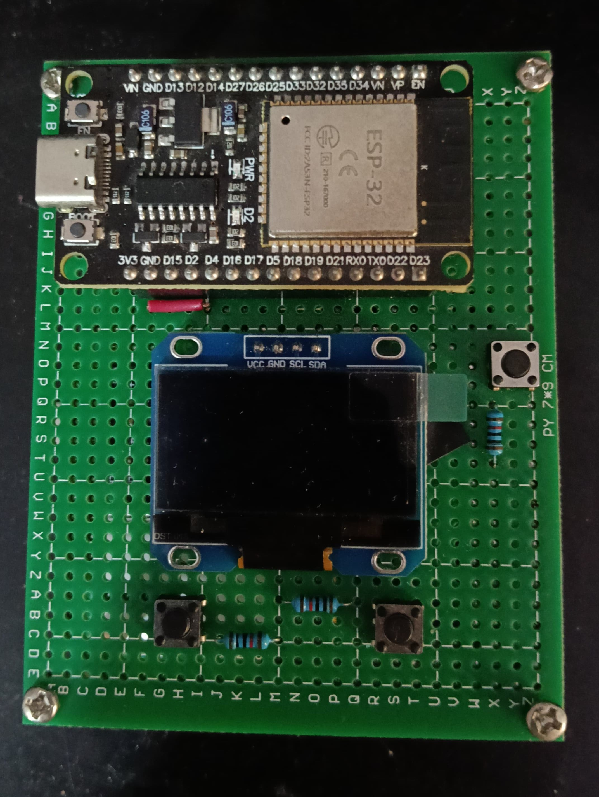
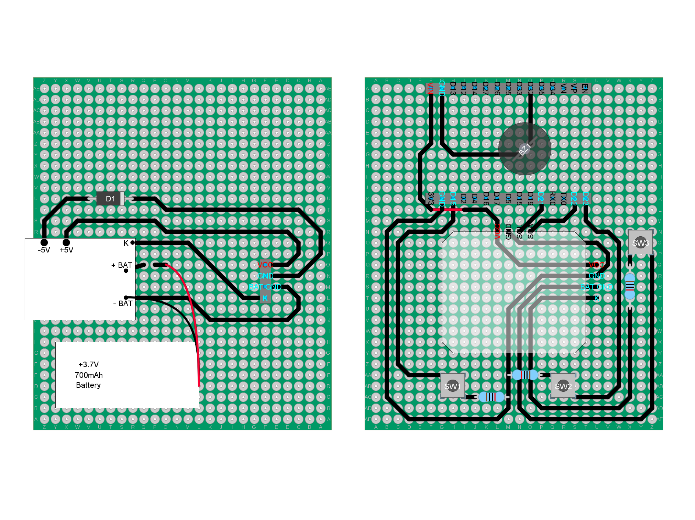
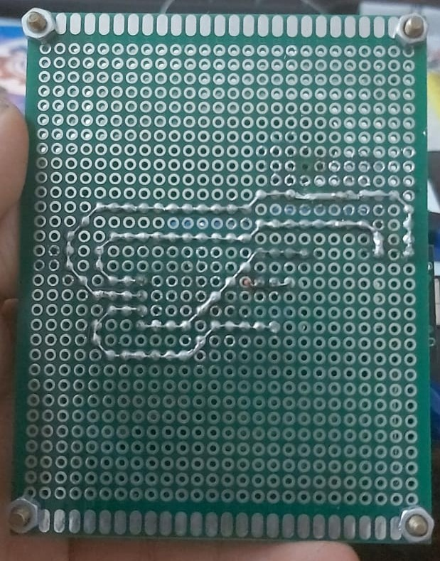
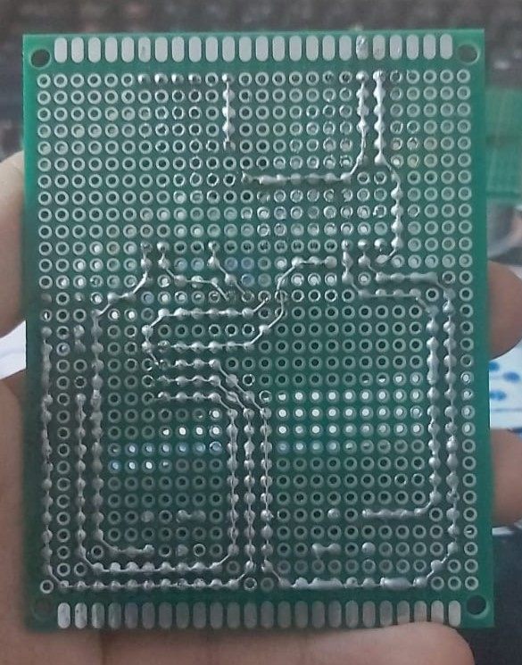

# ESP32 Handheld Screen Device

A standalone, battery-powered handheld device built around an ESP32. It shows a set of screens (text, images, animations) on a 1.3" OLED, you flip through them with two buttons, and a melody plays on a buzzer in the background the whole time.



**Demo video:** https://youtube.com/shorts/JVhx-ePU6OE

The video shows the melody playing in the background while I switch between screens with the buttons. Neither one disturbs the other. It does not show the wiring.

## Contents

- [Background](#background)
- [Features](#features)
- [Quick user guide](#quick-user-guide)
- [Hardware](#hardware)
- [Firmware architecture](#firmware-architecture)
- [Problems I ran into](#problems-i-ran-into)
- [Adding your own content](#adding-your-own-content)
- [Build and flash](#build-and-flash)
- [Known limitations and ideas](#known-limitations-and-ideas)
- [Repository layout](#repository-layout)

## Background

This started as a DIY birthday gift. A friend asked me for something with a screen that would show things for his friend. That was the whole requirement. I decided to build it as a complete handheld device instead of a screen wired to a board: everything is built in, the battery included, and there is nothing to plug in to use it. I used the ESP32 board he already had.

Two goals shaped the design:

1. **The firmware must be safe to extend.** The friend who requested it is not going to debug my code, so he must be able to add or remove screens and change the melody without touching (or breaking) the core code.
2. **The hardware must be hard to connect the wrong way.** I killed a display once by connecting power backwards, so I designed the boards so that wrong connections are physically impossible (see [Preventing wrong connections](#preventing-wrong-connections)).

## Features

- Three kinds of screens: text, static image, animation.
- Forward and backward buttons. Forward wraps around to the first screen, backward stops at the first screen.
- A melody that loops in the background and is not affected by navigation.
- Rechargeable over USB-C, with the battery built in.
- Adding a screen means creating one new file and adding two lines in the main file. Changing the song means editing two arrays.

## Quick user guide

**Turning it on:** short press the power button.

**Moving between screens:**
- Forward button: next screen. On the last screen it goes back to the first one.
- Backward button: previous screen. On the first screen it stays there.

**Charging:** plug a normal 5 V USB-C charger into the USB-C port of the power module.

The melody plays by itself while the device is on.

## Hardware

### Parts

| Part | Notes |
|---|---|
| ESP32 development board | The only part that can be unplugged from the device |
| OLED 1.3", SH1106, 128x64, I2C | Address 0x3C |
| Passive buzzer | Driven with PWM (LEDC) |
| 3 push buttons | Power, forward, backward |
| LiPo battery, 3.7 V, about 700 mAh | Small flat cell |
| Generic Type-C 5 V / 2 A charger + boost power-bank module | No brand or model name, see below |
| 2 perfboards, 25 mm spacers, 25 mm pin headers | The two boards are stacked |

### Pin map

| Function | ESP32 pin |
|---|---|
| OLED SDA | GPIO22 |
| OLED SCL | GPIO21 |
| Buzzer | GPIO32 |
| Forward button | GPIO23 |
| Backward button | GPIO15 |

The buttons use `INPUT_PULLUP`, so an idle button reads HIGH and a press reads LOW. Each button is wired as ESP32 pin -> button -> 10 kΩ -> GND. The series resistor is not electrically required with `INPUT_PULLUP`; it is there in this build and does not change the behavior.

### Power

The bottom board holds the battery and the power module. The module does the charging (USB-C in), protects the battery, and boosts the battery voltage to 5 V for the rest of the circuit.

- The battery is glued to the power board and connected to the module through a removable jumper, so I can disconnect it completely.
- The module has a key pin ("K"). A push button connected to it turns the 5 V output on. The module turns the output off by itself when the load stays very low.
- The 5 V output, ground and the key line go up to the logic board through the pin headers.

The module has no name anywhere, even on the shops that sell it. These are the figures from the seller's listing, not measured by me:

- Input: 5 to 5.5 V
- Charge current: up to 2.4 A
- Boost output: 5 to 5.15 V, up to 2 A, about 100 mV ripple
- Output switches off when the load stays under about 50 mA
- External button on the K pin: short press turns the output on, two short presses turn it off

### Build

The circuit is split over two perfboards connected by 25 mm pin headers and 25 mm spacers (same length, so the boards sit parallel):

- **Power board (bottom):** battery, power module, battery jumper.
- **Logic board (top):** ESP32, OLED, buzzer (under the ESP32), the three push buttons and the pin headers.

I designed the layout in DIY Layout Creator first and then built it with traces made from thin copper wire soldered on the perfboard, so it is closer to a PCB design than to a loose prototype.







### Preventing wrong connections

My first version used jumper wires between the two boards. It worked through a lot of tests, and then one time I connected the supply polarity backwards. Nothing burned except the OLED, which died, and I had to buy a new one. I looked for a way to make this mistake impossible, both for me and for the person who gets the device.

The wires were also a mechanical weak point, so I replaced them with pin headers. Then I placed the headers in one corner (one quadrant) of the boards instead of the center. If you rotate or flip either board, the headers no longer line up, so the boards can only be stacked the one correct way. This is mechanical keying (poka-yoke). I could have added more protection, but it would have been over-engineering for this project.

## Firmware architecture

The idea is that the core code is finished and never needs to change. New content goes in its own files.

### Files

| File | Responsibility |
|---|---|
| `ESP-32_with_OLED_Screen_present.ino` | Main file. Sets up the OLED, buzzer and buttons, starts the tasks, keeps the list of screens and moves an index forward/backward on button presses. It does not know what is inside a screen. |
| `Screens.h` | The data model only: what a `Screen` is. No content. |
| `src/screens/*.cpp` | One file per screen. Each defines one `Screen` with its own data (text lines, or bitmap frames). A screen file never draws anything. |
| `Rendering.h` / `Rendering.cpp` | The only code that knows how to draw a `Screen`, based on its type. Written once and shared by all screens. |
| `Buzzer.h` / `Buzzer.cpp` | Everything related to the buzzer, including the melody (two arrays). |

### Data model   


A `Screen` has a type (`SCREEN_TYPE_TEXT`, `SCREEN_TYPE_IMAGE`, `SCREEN_TYPE_GIF`) and only the fields that type needs: text lines and text size, or a list of bitmap frames plus a delay between frames. Because every screen is the same kind of object, the main file just stores pointers to them in an array and moves through it.

### Buzzer

The melody is two arrays, notes and durations, in `Buzzer.cpp`. Playback is a non-blocking state machine driven by `millis()`: each note sounds for about 90% of its duration, then is silent for 10% so repeated notes are separated, then it moves to the next note and loops forever. The tone is produced with `ledcWriteTone` on the LEDC PWM peripheral.

### How things run at the same time

- **Buzzer task** (FreeRTOS, core 0): calls the playback update every 5 ms.
- **Render task** (FreeRTOS, core 0): reads which screen is selected and draws it. It draws in short slices and checks the selected screen again between slices, so a button press takes effect quickly.
- **Main loop** (core 1): polls both buttons with a 50 ms software debounce and only changes the shared `currentScreenIndex`. Only the loop writes this variable and only the render task reads it, so no lock is needed.

## Problems I ran into

**1. Drawing blocked the song.** In the first version the melody and the display were handled in the same flow, so while the OLED was being drawn the song stuttered. I rewrote the playback as a non-blocking state machine and moved it into its own FreeRTOS task.

**2. A looping animation blocked navigation.** I tested with an animation that plays once and it was fine. Then I realized a real animation that repeats forever would keep the drawing code busy all the time, and I would not be able to leave that screen without resetting the board. I separated navigation (button handling) from rendering: the buttons only change an index, and the render task draws short slices and re-reads the index between them.

**3. GPIO34 cannot drive the buzzer.** I first put the buzzer on GPIO34, but on the ESP32 that pin is input-only, so there was no PWM output. I moved it to GPIO32.

**4. Reversed power killed the OLED.** See [Preventing wrong connections](#preventing-wrong-connections).

## Adding your own content

You do not need to edit `Rendering`, `Screens.h` or `Buzzer` for any of this.

### Add a screen

1. Create a new `.cpp` file in `src/screens/`. Name it after its content (for example `dog.cpp`).
2. Use `screen1_text.cpp` (text) or `screen2_rain.cpp` (animation) as a template. The file includes `Screens.h` and defines one global `Screen`.
3. In the main `.ino` file, add one `extern Screen yourScreenName;` line next to the existing ones.
4. In the main `.ino` file, add `&yourScreenName` to the `screens[]` array.

Rules for the screen type:
- A single picture should use `SCREEN_TYPE_IMAGE` with one frame.
- An animation uses `SCREEN_TYPE_GIF` with more than one frame and a frame delay greater than 0.

The `src` folder matters: the Arduino IDE compiles extra `.cpp` files only if they are in the sketch folder or inside a folder named `src`. That is why screens live in `src/screens/`.

### Make a picture for a screen

I use an online image-to-bitmap converter (Javl's image2cpp). The picture has to be a monochrome bitmap, at most 128x64, in horizontal byte order, as an Arduino array stored with `PROGMEM`. `screen4_github.cpp` is an example of a full-screen 128x64 bitmap.

### Change the song

Open `Buzzer.cpp` and edit the two arrays `currentSongNotes` and `currentSongDurations`. They must have the same length, with each note matched to its duration. Nothing else needs to change.

## Build and flash

- Arduino IDE with the ESP32 board package (Arduino-ESP32 core 3.x, because the code uses the pin-based LEDC functions `ledcAttach` and `ledcWriteTone`).
- Libraries: Adafruit GFX Library and Adafruit SH110X.
- Open the `.ino` file, select your ESP32 board and port, and upload.

## Known limitations and ideas

- **Content is compiled into the firmware.** Adding a screen or changing the song needs a re-flash from a computer.
- **The power module is generic.** Its rated charge current (up to 2.4 A) is much higher than the usual 0.5C to 1C for a 700 mAh cell. A next revision would use a charger IC with a configurable current limit.
- **Wrong-connection protection is mechanical only.** There is no electrical reverse-polarity protection. Adding it is the next step.
- **It is a perfboard prototype.** The layout was designed like a PCB, so moving it to a real PCB (for example in KiCad) would be natural.
- **Backward navigation does not wrap** on purpose; forward does.

## Repository layout

```
ESP-32_with_OLED_Screen_present/
├── ESP-32_with_OLED_Screen_present.ino   (main file)
├── Buzzer.h / Buzzer.cpp
├── Screens.h
├── Rendering.h / Rendering.cpp
├── src/
│   └── screens/                          (one file per screen)
└── docs/                                 (layout and build photos)
```
